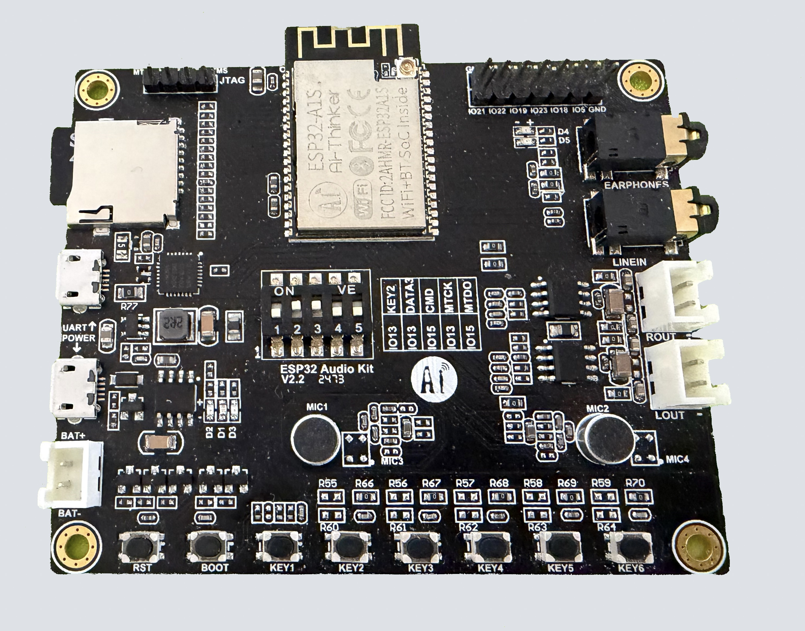
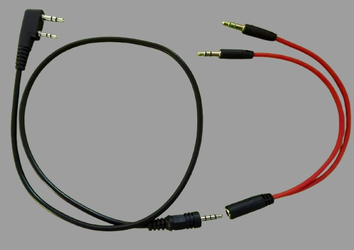

# esprepeater
Simplex parrot-style repeater for handheld radios based on ESP32 (Audiokit) boards using Arduino

# Features
This projects makes use of ESP32 Audiokit boards to build a simplex (also called parrot) repeater for handhled radios (tested with Quansheng, Baofeng and other brands)
Target audience is amateur radios seeking a cheap and simple way to make a radio repeater using Arduino. 


# Required hardware:
1. ESP32 Audiokit board. List of supported boards (https://github.com/pschatzmann/arduino-audio-tools/wiki/Audio-Boards)



2. Handheld radio with jack Kenwood-style connector (Baofeng, Quansheng, ...)

3. Audio cable
# Commercial audio cable
Kenwood to 3.5mm 4-pin jack connector  
Jack 3.5mm stereo to mic & speaker jack splitter


You may also replace 3 and 4 with your own DIY audio cable (see details below)

# DIY audio cable


4. PC running Arduino IDE (https://docs.arduino.cc/software/ide) (Windows/Mac OS/Linux is OK)
5. Micro USB cable to connect ESP32 board

# Building
1. Download and install latest version of Arduino IDE https://www.arduino.cc/en/software/ (available for Windows/Mac OS/Linux)
2. Download and install Git using defaults https://git-scm.com/install/
3. Download project contents using Git:
```
cd Documents/Arduino
git clone https://github.com/phmougin/esprepeater.git
```
