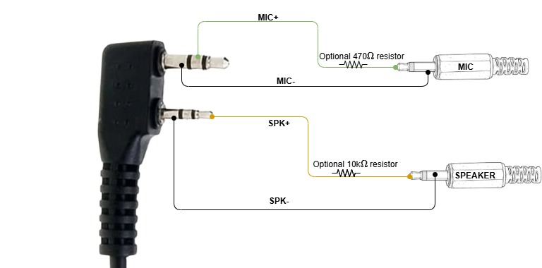

# esprepeater
Simplex parrot-style repeater for handheld radios based on ESP32 (Audiokit) boards using Arduino

# Features
This projects makes use of ESP32 Audiokit boards to build a simplex (also called parrot) repeater for handhled radios (tested with Quansheng, Baofeng and other brands)
Target audience is amateur radios seeking a cheap and simple way to make a radio repeater using Arduino. 

# Required hardware:
1. ESP32 Audiokit board
2. Handheld radio with jack Kenwood-style connector (Baofeng, Quansheng, ...)
3. Kenwood to 3.5mm 4-pin jack connector
4. Jack 3.5mm stereo to mic & speaker jack splitter
You may also replace 3 and 4 with your own DIY audio cable (see details below)
5. PC running Arduino IDE (https://docs.arduino.cc/software/ide) (Windows/Mac OS/Linux is OK)
6. Micro USB cable to connect ESP32 board

# DIY audio cable

